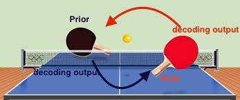
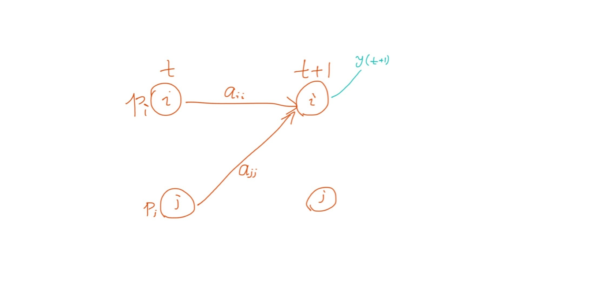
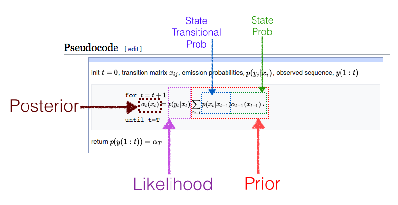
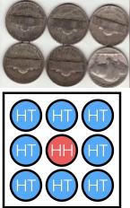

# TurboCoding & Hidden Markov Model(HMM)
This is about Hidden Markov Model, Forward algorithm and Turbo decoder. 

Turbo decoding is a belief propogation algorithm. The Turbo decoder consists of two MAP decoders. One decoder makes use of the output of the other deocoder's output as aprior information. Then the two decoders propogate information in a "turbo" way, and eventually output a robust decoding result.

Turbo decoder is based on MAP decoders, and MAP decoders requests forward algorithm. 

## Forward algorithm
Forward algorithm is the basic of Turbo decoding, and it can be illustrated as “re-adjust the Prob distribution by weights, where Likelihoods are used as weights”

It is very similar to the famous question of [Which coin ?](https://www.quora.com/A-jar-has-1000-coins-of-which-999-are-fair-and-1-is-double-headed-Pick-a-coin-at-random-and-toss-it-10-times-Given-that-you-see-10-heads-what-is-the-probability-that-the-next-toss-of-that-coin-is-also-a-head) 

## MAP decoder
In MAP deocder, the forward algorithm of HMM gets the state Prob (Alpha) for k-1 state, the backward algorithm gets the stat Prob (Beta) for k state, and the obervation of k-th index gives the transit Prob (Gamma) from k-1 to k. 
Alpha \times Beta \times Gamma is the final Prob of the tuple of states (k-1, k) which corresponds to the decoding output.

## Turbo
The decoding output of MAP-1 can be used by MAP-2 as aprior information (Gamma). Due to the two encoders (yes, encoders) are randomly shuffled, the information propagate between the two decoders and give good result. 

## Related Posts of Mine
* [Forward Algorithm for HMM](https://algorithmsdatascience.quora.com/A-quick-note-of-forward-algorithm-for-HMM) 
* [Turbo decoding](https://algorithmsdatascience.quora.com/HMM-Part-7-MAP-Decoder-of-Convolutional-Code-Turbo-Code-GitHub-included) 

## Note
This is an simple but complete example of Turbo decoder written in MATLAB by Bob G. It demonstrates how to use "forward algorithm" and "backward algorithm" of a Hidden Markov Model to make a MAP decoder, and then use the MAP decoder to further build a Turbo decoder.

The output of my code is a little bit differnt from what was given by this pdf document [Turbo Code Primer](http://vashe.org/turbo/turbo_primer_0.0.pdf).
The output of the 5th iteration  of my code is exactly the same as the output of the 3rd iteration of the pdf. It looks that the pdf document missed the 2,3,4th iterations. (It is really good tutorial though)

